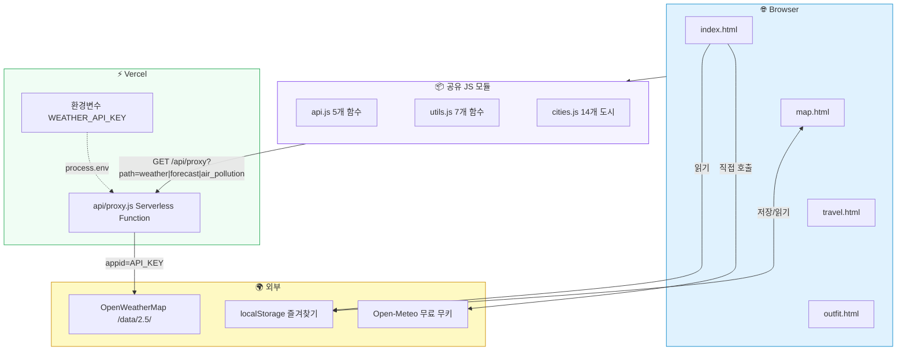
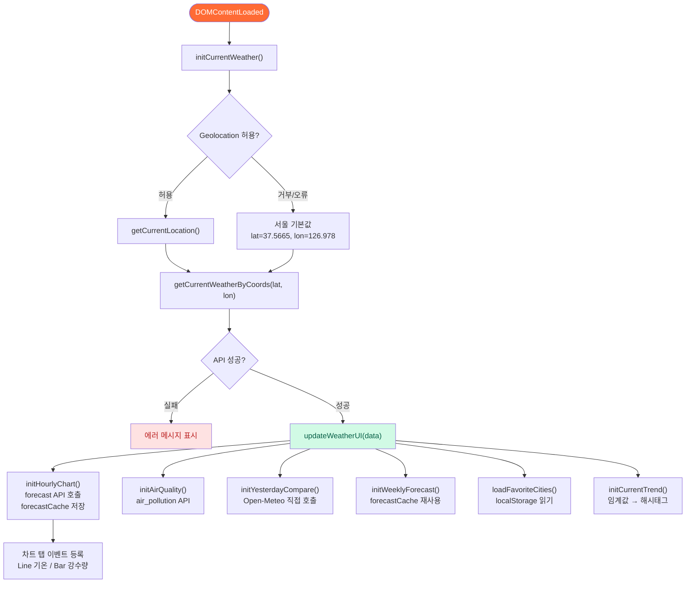
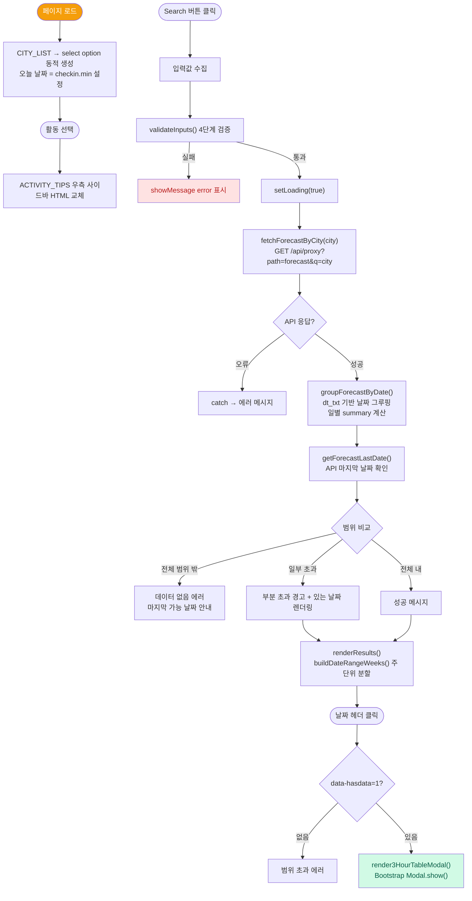
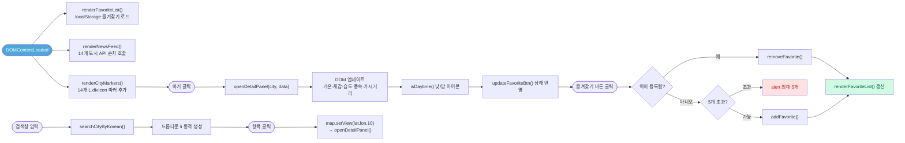
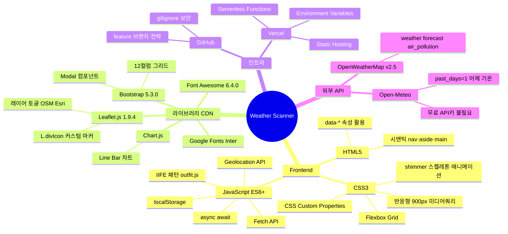
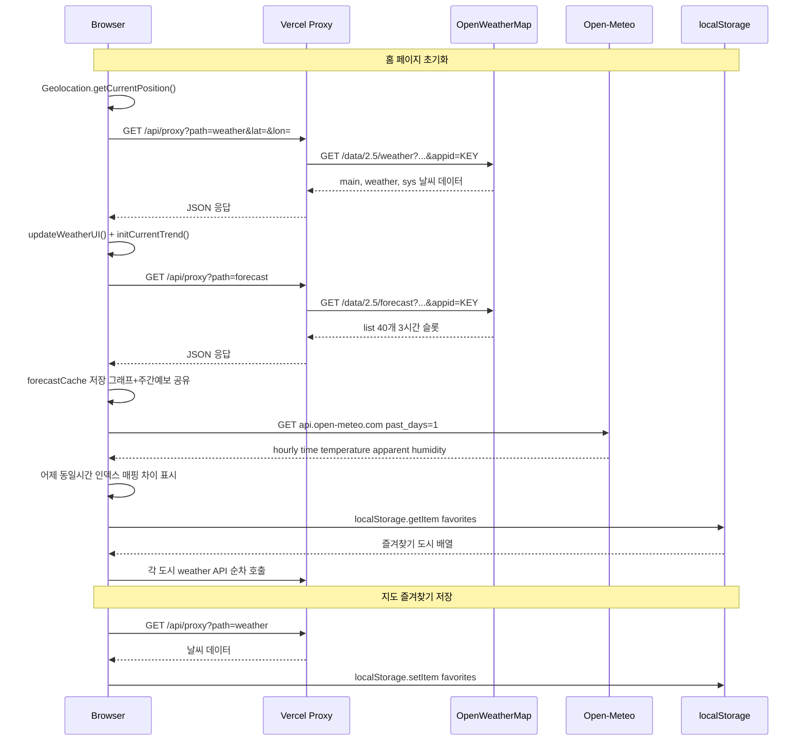
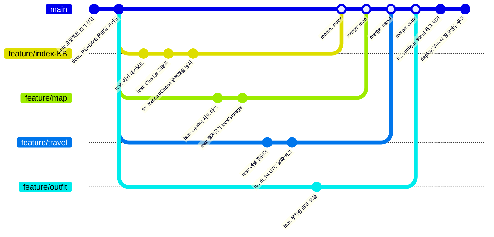

# ☁️ Weather Scanner (Weatherman)

> **프로젝트 문서** : 기능 정의서 · 플로우차트 · 기술스택 | 전체 소스코드 분석 결과

`📄 4 Pages (MPA)` `⚡ Vercel Serverless` `🌐 OpenWeatherMap API v2.5` `🗺️ Leaflet.js 1.9.4` `📊 Chart.js` `🅱️ Bootstrap 5.3`

---

## 📑 목차
1. [📌 프로젝트 개요](#-프로젝트-개요)
2. [📋 기능 정의서](#-기능-정의서)
3. [🏗️ 시스템 아키텍처](#️-시스템-아키텍처)
4. [🔄 홈 플로우](#-홈-플로우)
5. [✈️ 여행 플로우](#️-여행-플로우)
6. [🗺️ 지도 플로우](#️-지도-플로우)
7. [📁 파일 구조](#-파일-구조)
8. [🛠️ 기술 스택](#️-기술-스택)
9. [🌐 API 명세](#-api-명세)
10. [📦 데이터 흐름](#-데이터-흐름)
11. [🌿 Git 브랜치 전략](#-git-브랜치-전략)

---

## 📌 프로젝트 개요

| 항목 | 내용 |
| :--- | :--- |
| **프로젝트명** | Weather Scanner |
| **목적** | 현재 날씨 조회 / 도시 지도 날씨 / 여행 기간 날씨 캘린더 / 옷차림 추천 |
| **아키텍처** | MPA — 팀원별 파일 분리로 Git 머지 충돌 최소화 |
| **배포** | Vercel (Static Hosting + Serverless Function) |
| **API 보안** | `config.js`는 `.gitignore`로 차단 → Vercel 환경변수 `WEATHER_API_KEY` → `api/proxy.js` 서버사이드 중계 |
| **공통 JS** | `api.js` · `utils.js` · `cities.js` — 4개 페이지 모두 로드 |
| **담당자** | 강기범(index·api·utils·map), 최지유(outfit), 정성모(index 공동), 강성종 (travel) |

---

## 📋 기능 정의서

### 🏠 index.html — 메인 대시보드
| ID | 기능명 | JS | 핵심 로직 | 상태 |
| :--- | :--- | :--- | :--- | :--- |
| `IDX-01` | 현재 위치 날씨 | `index.js`, `utils.js` | `getCurrentLocation()` → `getCurrentWeatherByCoords()` → `updateWeatherUI()`. 위치 차단 시 서울 기본값 | ✅ 완료 |
| `IDX-02` | 시간별 날씨 그래프 | `index.js` | Chart.js Line(기온) · Bar(강수량) 탭 전환. `forecastCache`로 API 중복 호출 방지. `maintainAspectRatio:false` | ✅ 완료 |
| `IDX-03` | 대기질 정보 | `index.js` | `getAirPollution()` → AQI 1~5등급 + PM10·PM2.5·CO·O₃·NO₂·SO₂ 수치 표시 | ✅ 완료 |
| `IDX-04` | 어제 이 시간과 비교 | `index.js` | Open-Meteo API 직접 호출(API키 불필요). `past_days=1`. `dt_txt`로 동일시간 매핑. ▲▼ 차이 색상 표시 | ✅ 완료 |
| `IDX-05` | 1주일 날씨 예보 | `index.js` | `forecastCache` 재사용(API 절약). `dt_txt` 날짜 기준 그루핑 → 최고·최저기온·이모지·설명 | ✅ 완료 |
| `IDX-06` | 즐겨찾기 도시 사이드바 | `index.js` | `localStorage("favorites")` — map.js와 동일 key 공유. 각 도시 API 호출 후 이모지+기온 표시 | ✅ 완료 |
| `IDX-07` | 실시간 날씨 트렌드 | `index.js` | 기온(5↓/35↑), 습도(80↑), 구름(80↑), 가시거리(1000↓) 임계값 → 해시태그 문구 동적 생성 | ✅ 완료 |
| `IDX-08` | 도시 검색창 | `index.js`, `cities.js` | `searchCityByKorean()` 결과 콘솔 출력. 드롭다운 UI는 TODO 주석으로 미구현 | ⚠️ UI 미구현 |

### 🗺️ map.html — 날씨 지도
| ID | 기능명 | JS | 핵심 로직 | 상태 |
| :--- | :--- | :--- | :--- | :--- |
| `MAP-01` | 인터랙티브 지도 | `map.js` | Leaflet `setView([36.5, 127.5], 7)` 한국 중심. OSM ↔ Esri 위성 레이어 토글 | ✅ 완료 |
| `MAP-02` | 도시 날씨 마커 | `map.js` | CITIES 14개 → `L.divIcon` 커스텀 HTML 마커(이모지+기온). 클릭 → `openDetailPanel()` | ✅ 완료 |
| `MAP-03` | 한글 도시 검색 자동완성 | `map.js`, `cities.js` | input → `searchCityByKorean()` → `li` 동적 생성 → 클릭 시 `map.setView()` + 상세 패널 | ✅ 완료 |
| `MAP-04` | 도시 날씨 상세 패널 | `map.js` | 기온·체감·습도·풍속·가시거리·낮/밤 아이콘(`isDaytime()`). 즐겨찾기 토글 버튼 포함 | ✅ 완료 |
| `MAP-05` | 즐겨찾기 저장/삭제 | `map.js` | `localStorage("favorites")` 최대 5개. `addFavorite()`·`removeFavorite()`·`getFavorites()` | ✅ 완료 |
| `MAP-06` | 내 위치 이동 버튼 | `map.js`, `utils.js` | `getCurrentLocation()` Promise → `map.setView(lat, lon, 10)` | ✅ 완료 |
| `MAP-07` | 주요 도시 뉴스 피드 | `map.js` | CITIES 14개 순차 API 호출 → 우측 사이드바 이모지+기온+습도 목록. 클릭 시 지도 이동 | ✅ 완료 |

### ✈️ travel.html — 여행 날씨
| ID | 기능명 | JS | 핵심 로직 | 상태 |
| :--- | :--- | :--- | :--- | :--- |
| `TRV-01` | 활동 선택 + 날씨 팁 | `travel.js` | `ACTIVITY_FIELD_MAP`(10종) change 이벤트 → `ACTIVITY_TIPS` HTML 우측 사이드바 동적 교체 | ✅ 완료 |
| `TRV-02` | 여행지 선택 (동적 생성) | `travel.js` | `CITY_LIST`(14개) → `select option` JS 동적 생성. `value=en`(API용), 표시는 `ko` | ✅ 완료 |
| `TRV-03` | 날짜 입력 검증 | `travel.js` | `validateInputs()` — 활동·여행지 미선택, 날짜 누락, 체크아웃<체크인, 과거 날짜 4가지 차단 | ✅ 완료 |
| `TRV-04` | 주차별 날씨 캘린더 | `travel.js` | `buildDateRangeWeeks()` 월~일 분할. 활동별 `ACTIVITY_FIELD_MAP` 행 렌더링. `FIELD_LABELS` 한글 표시 | ✅ 완료 |
| `TRV-05` | 3시간 예보 모달 | `travel.js` | 날짜 헤더 클릭 → `render3HourTableModal()` → Bootstrap Modal. 12개 날씨 행(기온·체감 등) | ✅ 완료 |
| `TRV-06` | UTC 날짜 버그 수정 | `travel.js` | `dtToLocalDateKey()` — `dt*1000`(UTC) 대신 `dt_txt.slice(0,10)`. 한국(UTC+9) 날짜 밀림 현상 해결 | ✅ 완료 |
| `TRV-07` | 캘린더 시각적 구분 | `travel.js`, `travel.css`| 체류 기간 하늘색 강조. 화·목 베이지, 토 연파랑 줄무늬. 날씨 지표 열 파란 배경. 체류 뱃지 | ✅ 완료 |

### 👕 outfit.html — 옷차림 추천
| ID | 기능명 | JS | 핵심 로직 | 상태 |
| :--- | :--- | :--- | :--- | :--- |
| `OFT-01` | 현재 위치 날씨 카드 | `outfit.js` | IIFE 패턴. Geolocation → `getCurrentWeatherByCoords()` → `setWeatherCard()`. `findCityByEn()` 변환 | ✅ 완료 |
| `OFT-02` | 체감온도 기반 추천 | `outfit.js` | `getOutfitByTemp(feels_like)` 8단계 분기. 이모지·계절·추천의류·팁 반환 | ✅ 완료 |
| `OFT-03` | 기온 가이드 사이드바 | HTML | 8단계 정적 렌더링. `.guide-hot/.warm/.mild` 등 CSS 클래스로 색상 구분 | ✅ 완료 |
| `OFT-04` | 오늘 vs 어제 비교 | `outfit.js` | `setLeftSidebar(todayTemp, feelsLike)` — 오늘·체감 연동. 어제 데이터는 `--`(Open-Meteo 미연동) | ⚠️ 어제 미연동 |

---

## 🏗️ 시스템 아키텍처

> 🔒 **API 키 보안:** 브라우저에서 OpenWeatherMap 직접 호출 불가. 반드시 `/api/proxy` 경유 → Vercel 서버리스에서 환경변수로 키 주입. `config.js`는 로컬 개발 전용이며 `.gitignore`로 GitHub에 절대 올라가지 않음.

---

## 🔄 홈 플로우 (index.js)

> 💡 **forecastCache:** `initHourlyChart()`에서 forecast API 결과를 모듈 변수에 저장. `initWeeklyForecast()`는 캐시가 있으면 API 재호출 없이 재사용하여 요청을 절약함.

---

## ✈️ 여행 플로우 (travel.js)

---

## 🗺️ 지도 플로우 (map.js)

---

## 🛠️ 기술 스택

| 분류 | 기술 | 버전 | 용도 | 페이지 |
| :--- | :--- | :--- | :--- | :--- |
| **언어** | HTML5 | — | 시맨틱 구조, `data-*` 속성 | 전체 |
| | CSS3 | — | CSS 변수, Flex/Grid, 미디어쿼리(900px), shimmer 애니메이션 | 전체 |
| | JavaScript ES6+ | — | async/await, Fetch, Geolocation, localStorage, IIFE | 전체 |
| **라이브러리** | Leaflet.js | 1.9.4 | 지도, `L.divIcon` 마커, 레이어 토글 | map |
| | Chart.js | latest | Line(기온) / Bar(강수량) 차트, 탭 전환 | index |
| | Bootstrap 5 | 5.3.0 | 12컬럼 그리드, `Modal` 인스턴스 | travel |
| | Font Awesome | 6.4.0 | 날씨 아이콘 (`fa-sun`, `fa-cloud-rain` 등) | 전체 |
| | Google Fonts | — | Inter 폰트 | 전체 |
| **인프라** | Vercel | — | 정적 호스팅 + `api/proxy.js` Serverless | 전체 |
| | GitHub | — | 소스 관리, 브랜치 전략, `.gitignore` | — |
| **외부 API** | OpenWeatherMap | v2.5 | `weather`·`forecast`·`air_pollution` | 전체 |
| | Open-Meteo | v1 | 어제 기온·체감·습도 (무료·API 키 불필요) | index |
| | localStorage | 내장 | 즐겨찾기 영구 저장 (key: `"favorites"`) | map, index |

---

## 🌐 API 명세

### `api.js` — 공통 함수 3개
| 함수명 | 호출 URL | 파라미터 | 응답 주요 데이터 | 사용처 |
| :--- | :--- | :--- | :--- | :--- |
| `getCurrentWeatherByCoords` | `/api/proxy?path=weather&lat=&lon=&units=metric&lang=kr` | lat, lon | 기온·체감·습도·풍속·날씨상태·일출·일몰 | index, map, outfit |
| `getForecastByCoords` | `/api/proxy?path=forecast&lat=&lon=` | lat, lon | 3시간×40슬롯 예보 리스트 | index |
| `getAirPollution` | `/api/proxy?path=air_pollution&lat=&lon=` | lat, lon | AQI 1~5등급, PM10·PM2.5·CO·O₃·NO₂·SO₂ | index |

### 페이지 내부 직접 호출 (api.js 미경유)
| 위치 | URL | 목적 | 특이사항 |
| :--- | :--- | :--- | :--- |
| `travel.js`   `fetchForecastByCity()` | `/api/proxy?path=forecast&q=city&units=metric&lang=kr` | 여행지 예보 | `api.js`의 `getForecast()` 미사용. travel.js 독립 함수. cod 오류 시 throw |
| `index.js`   `initYesterdayCompare()` | `https://api.open-meteo.com/v1/forecast?past_days=1&hourly=temperature_2m,apparent_temperature,relativehumidity_2m` | 어제 동일시간 기온·체감·습도 | API 키 불필요. proxy 미경유. `YYYY-MM-DDTHH:00`으로 시간 매핑 |

---

## 📦 데이터 흐름

### `utils.js` 함수 목록
| 함수명 | 입력 | 반환 | 사용처 |
| :--- | :--- | :--- | :--- |
| `formatHour(unix)` | Unix timestamp | "오전 9시" (ko-KR) | index 그래프 X축 |
| `celsiusToFahrenheit(c)` | 섭씨 | 화씨 정수 | 정의만, 미사용 |
| `roundTemp(temp)` | 소수 기온 | 정수 기온 | 전체 |
| `getCurrentLocation()` | — | `Promise<Position>` | index, map, outfit |
| `isDaytime(sunrise, sunset)` | Unix 시각 2개 | boolean | index, map 아이콘 색 |
| `getWeatherIconClass(main, sr, ss)`| 날씨상태·일출·일몰 | FontAwesome 클래스명 | index, map |
| `getWeatherEmoji(main)` | 날씨상태 영어 | 이모지 문자 | index, map |

---

## 🌿 Git 브랜치 전략

| 브랜치 | 용도 | 규칙 |
| :--- | :--- | :--- |
| `main` | 배포 브랜치. Vercel이 자동 빌드·배포 | 직접 push 금지. PR·merge만 |
| `develop` | 통합 개발 브랜치 (선택적) | feature → develop → main |
| `feature/[기능명]-[이니셜]` | 기능 단위 개발 | 예: `feature/map-KB`, `feature/outfit-JY` |

> 💡 **MPA를 선택한 이유:** 팀원별로 담당 파일(HTML·CSS·JS)이 완전히 분리되어 SPA 대비 공통 파일 수정 빈도가 낮고 Git 머지 충돌 가능성이 크게 줄어듭니다.
